# 🧱 Minecraft Server 🗺

 
 
 `Está precisando hospedar um servidor de Minecraft para jogar com os rapazes?`

 # Que tal criar seu próprio Host?

`requisitos mínimos:`
  * Cabo Ethernet / Roteador.
  * 1 Pen drive.
  * 1 Computador velho (monitor, teclado, etc.)
    * Intel® Core™ i3 ou i5 / AMD Ryzen.
    * 4 GB de RAM min.
    * 10 GB de espaço disponível.

## 1 - Debian

Um sistema operacional com acesso à internet vai ser necessário para rodar o servidor, nesse caso será usado o Debian.
Você pode escolher entre instalar diretamente em um PC ou usar uma Máquina Virtual.

* SERVIDOR NO PC
  * Você vai usar o etcher pra fazer a instalação do debian através de um pen drive diretamente na máquina. Não esqueça de configurar a BIOS para acessar o pen drive pelo BOOT.
 
  * [Etcher.Balena](https://etcher.balena.io)
  * [Debian](https://www.debian.org/download)

* SERVIDOR NA VM
  * Caso use uma maquina virtual, você terá que configura-la manualmente a quantidade de RAM e processamento. Depois é só usar o ISO do debian.
    
  * [VMware](https://www.vmware.com/br/products/workstation-player/workstation-player-evaluation.html)
  * [Debian](https://www.debian.org/download)
 
## 2 - Instalando o Debian

Ao acessar o sistema operacional, você vai ver essa tela:

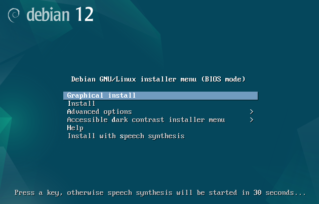 

Mas não se preocupe! Você que é um lerdão, vai ter o passo a passo da instalação mastigadinho, só clicar aí:

<b>😎 Instalação: </b>

    1  - Selecione Graphical Install
    2  - Selecione o idioma
    3  - Selecione a localização
    4  - Selecione a configuração do teclado
    5  - Selecione o seu hostname (ex: mc-server)
    6  - Selecione o nome do dominio (ex: local)
    7  - Tela de Senha root (pode pular essa parte apertando Enter)
    8  - Selecione o nome do seu usuário (você vai precisar dele para acessar o servidor)
    9  - Selecione a senha do seu usuário (use uma senha que você não vai esquecer)
    10 - Selecione a região do fuso horario
    11 - Selecione "Guided - use entire disk"
    12 - Selecione o Seu HD, SSD, etc.
    13 - Selecione "All files in one partition"
    14 - Selecione "Finish partitioning and write changes to disk"
    15 - Selecione "Sim"
    16 - Selecione "Não"
    17 - Selecione a localização
    18 - Selecione "deb.debian.org"
    19 - Tela de Proxy (pode pular)
    20 - Selecione "Não"
    21 - DESMARQUE as opções "Debian desktop enviroment" e "GNOME" e MARQUE a opção "SSH Server"
    22 - Selecione "Sim"
    23 - Selecione "dev/sda"
    24 - Aguarde o final da instalação e seleciona a opção "Reboot"
    25 - Não esqueça de remover seu pen drive.

## 3 - Terminal

Meus parabéns! Você instalou o Debian com sucesso! Agora vamos deixar ele um pouco mais amigável.

Você vai precisar de acesso a internet para continuar a partir de agora.

* Escreva o usuário e senha que você escolheu durante a instalação, se você esqueceu pode fechar o tutorial já.

  * 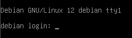
  
  * ( Quando você escreve a senha ela não aparece na tela. Sim, isso é normal. )
 
* Escreva:
  `sudo apt update`
  * 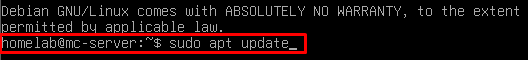
  * Escreva a sua senha

* Caso precise atualizar o debian, escreva:
  `sudo apt upgrade -y`
  * 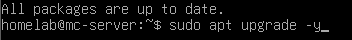

* Escreva:
  `sudo apt install curl`
  * 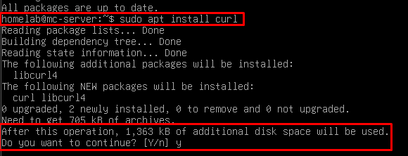
  * escolha Y para aceitar

* Escreva:
  `curl -fsSL https://get.casaos.io | sudo bash`
  * 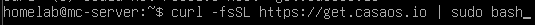

* Se tudo deu certo, você vai ver essa tela
  * 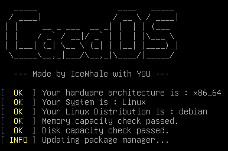
  * Agora é esperar a instalação acabar, vai pegar um ☕.

 ## 4 - CasaOS
 
* Ao terminar a instalação, a única coisa que você precisa se preocupar é com o IP que vai aparecer na tela:
  * 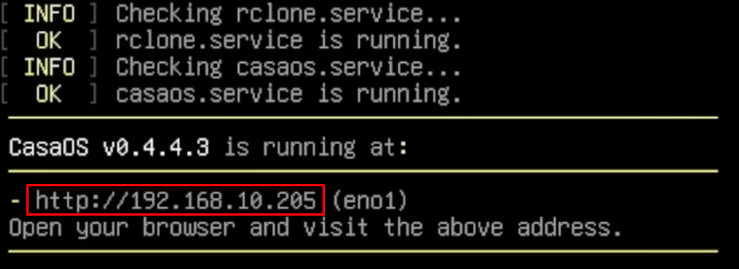

  * Esse é o endereço IP local do seu servidor (não é seu o IP, calma)

  * Agora você pode acessar o seu servidor pelo CasaOS através do seu browser, na sua internet local.

* Digite o IP que apareceu pra você na busca do seu browser e você vai ver essa tela:
  
  * 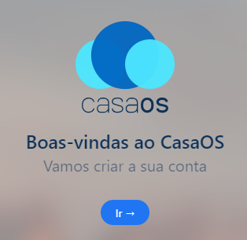

 * Crie uma conta e você poderá acessar o CasaOS sem problemas.

  * 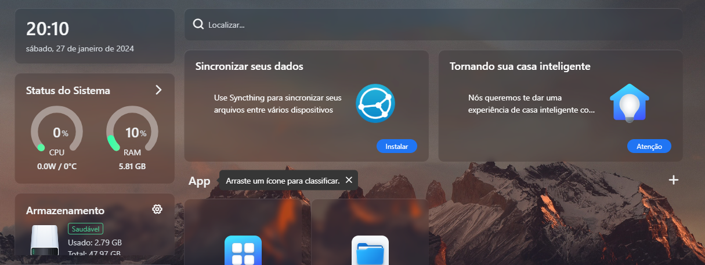

* Dentro do CasaOS acesse a AppStore e baixe o Craft Controller.

  * 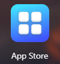 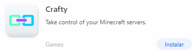
  
* Após baixar, o Crafty vai criar pra você um usuário e senha para acessa-lo ( Sim, você vai ter q decorar uns 4 logins e senhas no processo completo. )

  * 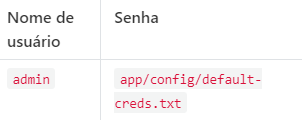

  * Você pode encontrar esse arquivo .txt dentro da pasta Files/AppData/crafty no Desktop, nele contem o seu login e senha do Crafty.
 
  * Salve as configurações do jeito que estão e clique pra acessar o App.

## 5 - Crafty Controller

* A primeira vez que você abrir, talvez você veja essa tela:

  * 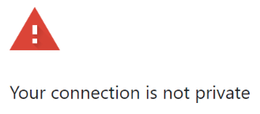

* Não se preocupe, isso é normal, apenas clique em avançado e prosseguir. ( 😈 ) 

* Quando ver essa tela, faça login com o usuário Admin + a senha que ele criou para você.

  * 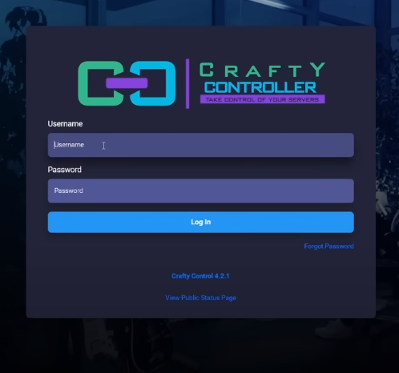

* Após fazer login, você vai ver o Dashboard do Crafty Controller.

* Para criar um servidor, clique em Servers -> Create new Server.

   * 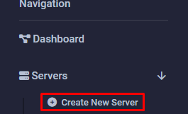

* Escolha o nome, tipo de e versão disponível para seu servidor.
   
   * 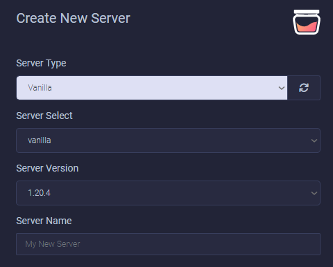

* Escolha a quantidade de RAM que você achar necessário, não esqueça de escolher de acordo com a quantidade disponível no seu PC/VM.

  * 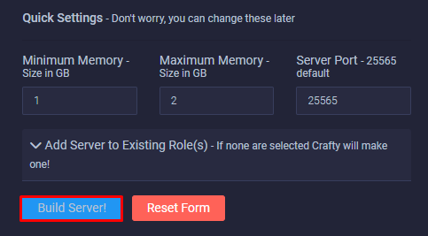

* Agora é só clicar em "Build Server".

* Depois do seu servidor ser criado e configurado, você vai ter acesso a diversos tipos de ferramentas dentro do Crafty

  * 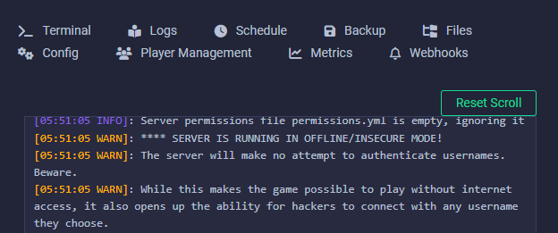

* A partir desse momento, seu servidor já está online na sua internet local, agora vamos ver como jogar com seus amigos online.

## 6 - Playit.gg

 * 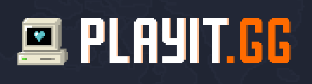
 * Acesse o site: [playit.gg](https://playit.gg)

* Crie uma conta e Baixe o Programa ou o Plugin
  * 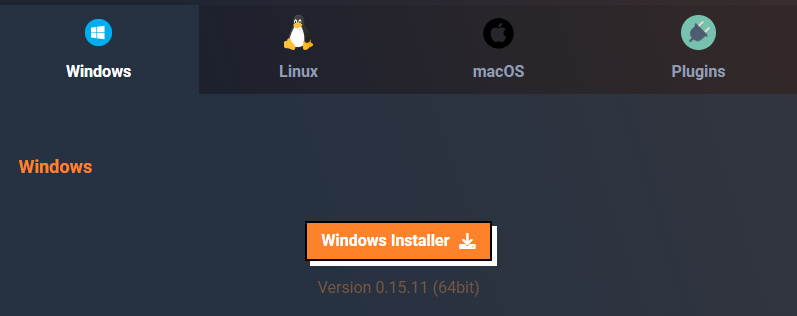

  

     

